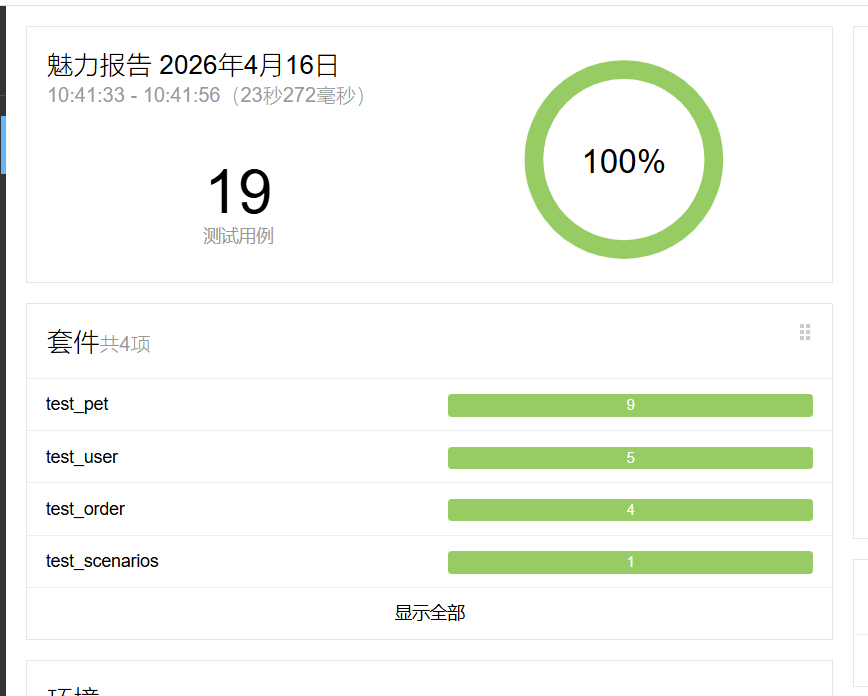
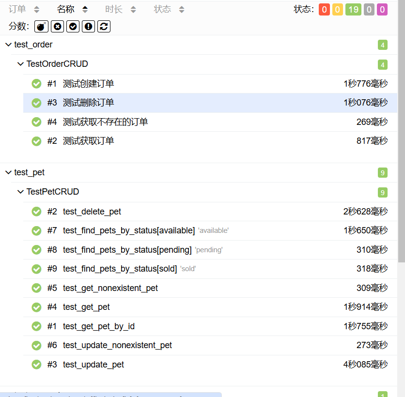
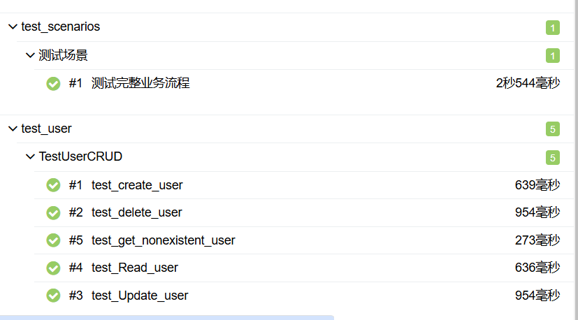

# Petstore API 自动化测试
基于 Python + Pytest + Requests + Allure 实现的接口自动化测试项目，覆盖 [Swagger Petstore](https://petstore.swagger.io/) 的宠物、订单、用户模块，包含正向测试、负向测试、参数化测试及完整业务流程场景。

## 技术栈
- Python 3.12
- Pytest
- Requests
- Allure

## 项目结构
petstore_tests/
├── conftest.py # 公共配置（BASE_URL、Session、重试函数、唯一ID生成）
├── test_pet.py # 宠物模块 CRUD + 负向测试 + 参数化测试
├── test_order.py # 订单模块 CRUD + 负向测试
├── test_user.py # 用户模块 CRUD + 负向测试
├── test_scenarios.py # 完整业务流程场景测试
├── requirements.txt # 依赖列表
└── README.md


## 快速开始
    ```bash
    git clone https://github.com/lpdewo/petstore_tests.git
    cd petstore_tests
    pip install -r requirements.txt
    pytest
    pytest --alluredir=./allure-results
    allure serve ./allure-results
    ```

## 测试覆盖
    | 模块 | 测试类型 | 测试点 |
    |------|----------|--------|
    | 宠物 | 正向测试 | 创建、查询、更新、删除 |
    | 宠物 | 负向测试 | 查询不存在的宠物、更新不存在的宠物 |
    | 宠物 | 参数化测试 | 按状态查询（available/pending/sold） |
    | 订单 | 正向测试 | 创建、查询、删除 |
    | 订单 | 负向测试 | 查询不存在的订单 |
    | 用户 | 正向测试 | 创建、查询、更新、删除 |
    | 用户 | 负向测试 | 查询不存在的用户 |
    | 场景 | 组合测试 | 用户注册 → 创建宠物 → 下单 → 查询订单 → 删除订单 → 删除宠物 |

## 设计亮点
    动态 ID：使用时间戳生成唯一 ID，避免测试数据冲突。
    重试机制：针对服务器异步延迟，封装 get_pet_with_retry 函数，提高测试稳定性。
    Session 复用：统一管理 HTTP 会话，关闭 SSL 警告。
    模块化设计：按业务模块拆分测试文件，公共工具放在 conftest.py。
    Allure 报告：生成可视化测试报告，包含请求/响应详情。

## 运行结果
    所有测试用例通过率 100%（19/19）。
    
    
    

## 作者
    lpdewo - https://github.com/lpdewo

## 参考
    Swagger Petstore API
    Pytest 官方文档
    Requests 库文档
    Allure 框架
